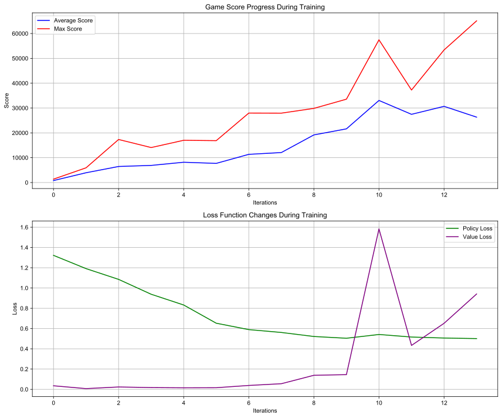

# 2048-AlphaZero

A project that implements an AI for the 2048 game using the AlphaZero algorithm. This project utilizes deep reinforcement learning and Monte Carlo Tree Search (MCTS) to learn optimal strategies for playing 2048.

## Project Structure

- `game_2048.py`: Core implementation of the 2048 game
- `neural_network.py`: Neural network model definition
- `mcts.py`: Monte Carlo Tree Search algorithm implementation
- `train.py`: Main training logic for the AI

## Requirements

- Python 3.11.9
- PyTorch >= 2.0.0
- NumPy >= 1.21.0
- tqdm >= 4.65.0

## Installation

1. Clone the repository:
```bash
git clone [your-repository-url]
cd 2048-alpha-zero
```

2. Install dependencies:
```bash
pip install -r requirements.txt
```

## Usage

1. Start training:
```bash
python train.py
```

The training process automatically saves model checkpoints and training logs. You can monitor the training progress in the `training.log` file.

## Training Results

Below is the training curve showing the score progression during training:



## Features

- Self-play training using the AlphaZero algorithm
- Multi-process parallel self-play support
- Complete implementation of 2048 game logic
- Deep neural network built with PyTorch
- Graceful training termination support
- Automatic checkpoint saving

## Implementation Details

- Deep convolutional neural network for policy and value networks
- Action selection and policy improvement through MCTS
- Experience replay for improved training efficiency
- Model saving and loading support 